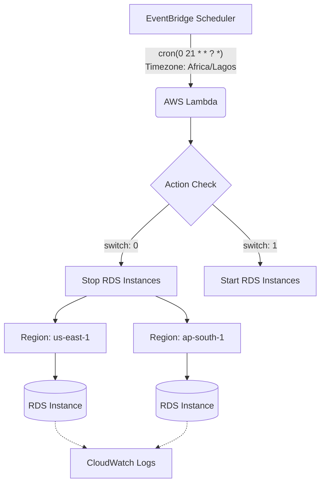
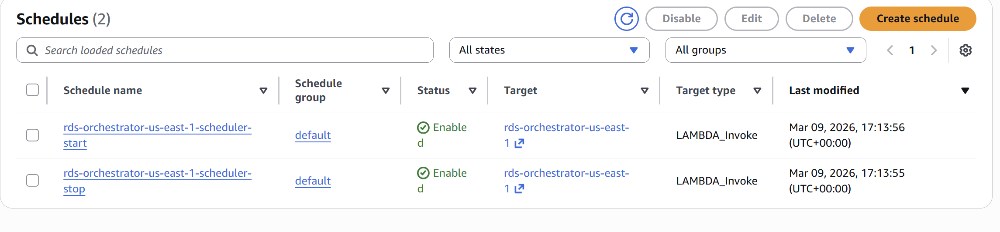
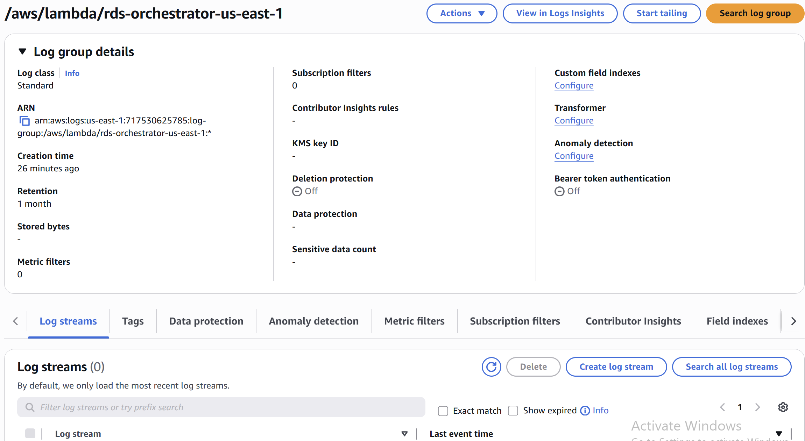
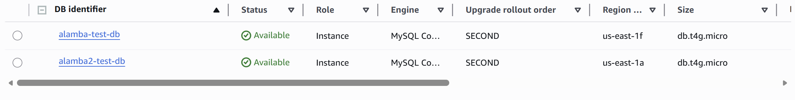
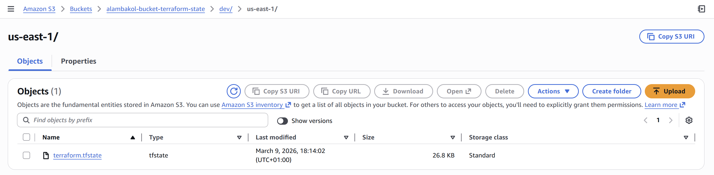
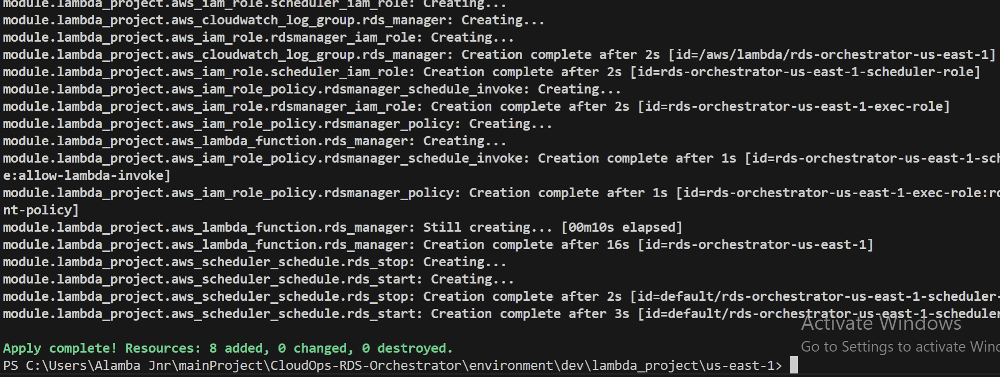

# ☁️ AWS RDS Automated Orchestrator

### **An Event-Driven Cost Optimization Framework**

## 📖 Project Vision

Managing non-production cloud costs is a primary challenge in modern DevOps. This repository contains a **production-grade serverless framework** designed to automate the operational lifecycle of Amazon RDS instances.

By implementing an event-driven "Start/Stop" architecture, this solution slashes database compute costs by **~61%** while ensuring environments are ready exactly when developers in the `Africa/Lagos` timezone start their day.

---

## 🏗 System Architecture

The solution is decoupled and stateless, ensuring zero maintenance and high durability.

### **The Logic Flow**

1. **Trigger:** **AWS EventBridge (Scheduler)** evaluates a Cron expression localized to `WAT (UTC+1)`.
2. **Orchestration:** **AWS Lambda (Python 3.12)** is invoked with a state payload (`Start` or `Stop`).
3. **Cross-Region Execution:** The function utilizes the **Boto3 SDK** to concurrently manage instances across `us-east-1` and `ap-south-1`.
4. **Audit Trail:** Every API transition is captured in **Amazon CloudWatch** for governance and compliance.



---

## 📈 Financial Impact (The "Bottom Line")

Automation isn't just about convenience—it's about fiscal responsibility.

| Metric | 24/7 Runtime | Automated (13/5) | Savings |
| --- | --- | --- | --- |
| **Weekly Runtime** | 168 Hours | 65 Hours | **61.3% Reduction** |
| **Est. Monthly Cost** | $240.00 | $93.60 | **$146.40/instance** |

> [!TIP]
> **Scaling Impact:** For a fleet of 10 `db.m5.large` instances, this automation saves approximately **$1,464 per month** ($17,500+ annually).

---

## 🛠 Technical Implementation

### **Infrastructure as Code (IaC)**

The entire stack is defined in **Terraform**, utilizing a modular pattern:

* **`modules/`**: Contains core logic (IAM Least Privilege roles, Lambda source, and Schedulers).
* **`environment/`**: Region-specific deployments (e.g., `dev/us-east-1`).
* **`backend/`**: Remote state storage in S3 with **DynamoDB state locking**.

### **Operational Evidence**

*Insert your first screenshot here*

> **Figure 1:** AWS Console showing the EventBridge Scheduler trigger successfully firing.

*Insert your second screenshot here*

> **Figure 2:** CloudWatch Logs demonstrating the Lambda function identifying and stopping the target instances.

---

## 🛡 Security & Governance

* **IAM Least Privilege:** The Lambda execution role is restricted to `rds:StartDBInstance`, `rds:StopDBInstance`, and `rds:DescribeDBInstances`. It has **no** permission to delete or modify instance classes.
* **Timezone Aware:** Uses `Africa/Lagos` to prevent "drift" during Daylight Savings transitions in other regions.
* **Error Resiliency:** The Python logic includes exception handling for instances already in a `stopping` or `starting` state to prevent execution failures.

---

### 📸 Execution Proof

| Step | Component | Visual Evidence |
| :--- | :--- | :--- |
| **1. Trigger** | EventBridge Scheduler |  |
| **2. Logic** | Lambda Execution Logs |  |
| **3. Result** | RDS Instance Status |  |
| **4. Result** | s3 Buckets |  |
| **5. Result** | Cloud Watch Status |  |
| **6. Result** | Terraform apply Status |  |

## 🚀 Getting Started

### **Prerequisites**

* Terraform v1.5+
* AWS CLI configured with DevOps/Admin permissions.

### **Deployment**

```bash
# 1. Initialize the backend
terraform init

# 2. Review the plan
terraform plan -var="timezone=Africa/Lagos"

# 3. Deploy
terraform apply -auto-approve

```

---

**Maintainer:** [Alamba Jnr](https://github.com/Alambajnr) – *CloudOps & DevOps Engineer*

---
